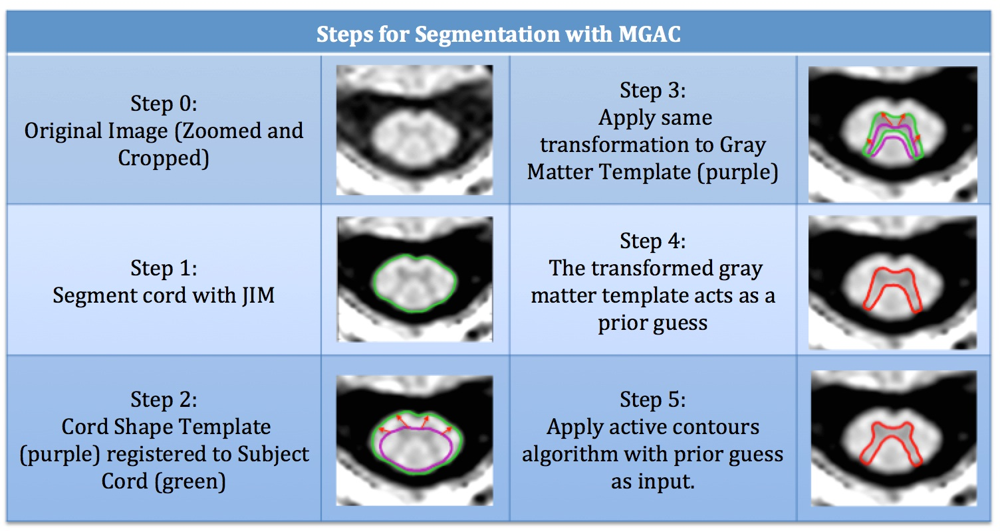
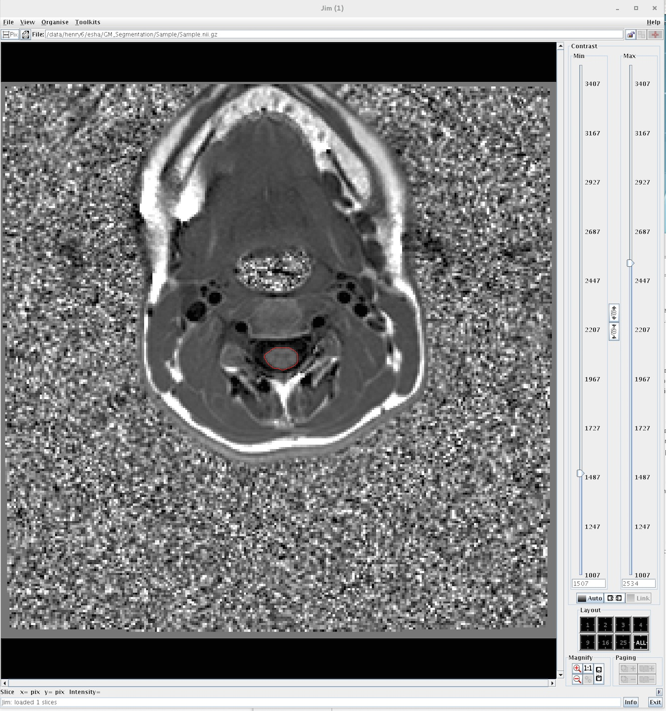
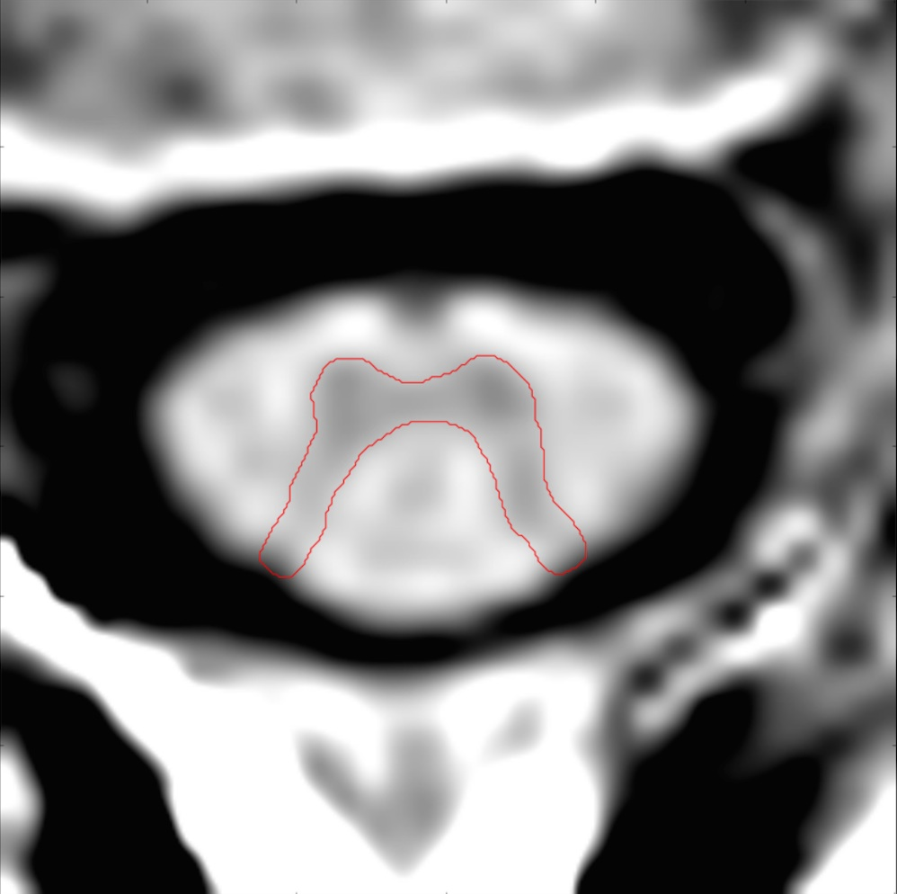

# SpinalCordGMSegment

This is an implementation of gray matter segmentation of the spinal cord with MGAC (Morphological Geodesic Active Contour) models in MRI images.

The accompanying paper is:
Datta, Esha, et al. "Gray matter segmentation of the spinal cord with active contours in mr images." NeuroImage 147 (2017): 788-799.

This method was entered into the Grey Matter Segmentation Challenge at the ISMRM conference in 2016.  The accompanying publication for the challenge is:
Prados, F., Ashburner, J., Blaiotta, C., Brosch, T., Carballido-Gamio, J., Cardoso, M.J., Conrad, B.N., Datta, E., Dávid, G., De Leener, B. and Dupont, S.M., 2017. Spinal cord grey matter segmentation challenge. Neuroimage, 152, pp.312-329.

This implementation uses the morphsnakes code described in this paper:
Márquez-Neila, P., Baumela, L., Álvarez, L., "A morphological approach to curvature-based evolution of curves and surfaces". IEEE Transactions on Pattern Analysis and Machine Intelligence (PAMI), 2013.

## Overview of Method

The spinal cord gray matter is segmented in 6 steps:



## Running the demo

In the Templates folder, there are two files:
* control_template.nii.gz is a template of cord masks created from 20 control subjects
* gm_mask_template.nii.gz is a template of grey matter masks created from 20 control subjects

In the Sample folder, there are two files:
* Sample.nii.gz is a 2D PSIR acquisition of the C2/C3 level of the spinal cord in a healthy control.
* Sample.roi is an file created by the software JIM that specifies the segmentation of the spinal cord.



To run the demo, enter the command:
```
gm_segmentation.py Sample
```

## Outputs
There will be eight outputs added to the Sample folder:

#### Zoomed Files
* Sample_zoomed.nii.gz is a nifti file that has been zoomed and cropped around the spinal cord segmentation from the JIM roi file
* Sample_zoomed_cord_mask.nii.gz is a nifti file of the JIM cord roi in the zoomed space
#### Registration of Cord Template to Subject Cord
* Sample_template_reg_to_subject.nii.gz is a nifti file of the cord template after it has been registered to the subject cord mask
* Sample_Affine.txt is a text file of the affine transformation from the cord template to the subject cord mask
* Sample_Warp.nii.gz is the warp transformation from the cord template to the subject cord mask
* Sample_InverseWarp.nii.gz is the inverse transformation from the subject cord to the cord template mask
#### Registration applied to Grey Matter Template
* Sample_prior.nii.gz is the grey matter template transformed to the subject cord space, which acts as a prior guess
#### Final Output of Segmented Gray Matter
* Sample_autoseg_gm.nii.gz is the final output of the nifti file of the grey matter segmentation in the zoomed space



